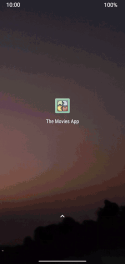

# The-Movies-App
A simple app illustrating some of the latest and greatest Android development principles.

## 👋🏼 Introduction - What is this ?
This app uses the [TMDB](https://www.themoviedb.org/documentation/api) api to fetch a list of movies and show it in a RecyclerView. If you click on a movie, it opens a detail page with an enlarged poster and the movie name. That's about it - that's all the app does. (This is not a real, usable app).

    

## 🤔 What is this - REALLY?
The app is REALLY about demonstrating usage of a some open source libraries and modern architecture patterns for Android development, such as the following :

- MVVM architecture pattern
- LiveData
- Coroutines
- Navigation Components
- Dagger 2 for Dependency Injection
- Room persistence library
- [Coil](https://github.com/coil-kt/coil) Image Loading Library
- [Retrofit](https://square.github.io/retrofit/) Networking Library
- [Lottie](https://airbnb.io/lottie/) for animations
- [Mockk](https://mockk.io/) for mocking in Unit/UI Tests

and a few others.

## ✨ Notable Features/Patterns
This app implements some frequently encountered patterns in Android development

### ©️ Caching data for Offline Viewing
The app caches data received via the API request in a local database (using Room) and uses that in subsequent app launches if there is no/sketchy internet connectivity. 

### 🔍 Empty/No Data screen + 🔄 Refresh pattern
In case there is no internet connectivity when the app is launched for the first time, you might encounter the following 'empty' screen :

In case, the connectivity comes back, you can press the reload button and the data is downloaded and shown.
